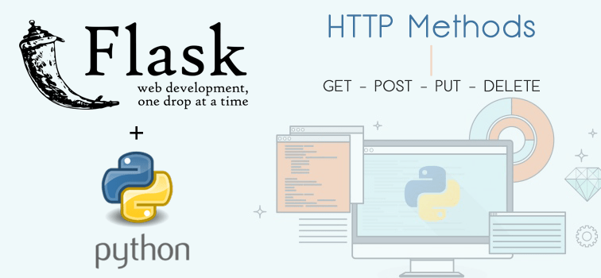
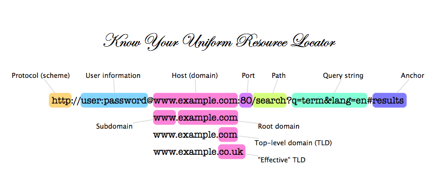

# Saving the markdown content to a .md file for user download

md_content = """
# Flask-03-04: If-For Yapısı, Routing ve Get-Post Metotlarını Kullanma

Bu uygulamalı eğitim, öğrencilerin form işleme konusunda temel bilgi sahibi olmalarını amaçlamaktadır.



## Öğrenim Hedefleri

Bu uygulamalı eğitimin sonunda öğrenciler;

- Flask framework ile basit bir web uygulaması oluşturabilecekler.
- HTTP request-response döngüsünü ve URL yapısını anlayabilecekler.
- Flask ile rotalar (views) oluşturabilecekler.
- Flask kullanarak statik içerik ve dosyalar sunabilecekler.
- HTML şablonları ile dinamik içerik sunabilecekler.
- Jinja Templating Engine kullanarak HTML şablonları yazabilecekler.
- Python Flask framework ile bir web uygulaması oluşturabilecekler.
- Flask ile if koşulları ve for döngüleri kullanabilecekler.
- Flask ile form işlemleri ve GET-POST yöntemlerini kullanabilecekler.
- Git repo kullanarak uygulamanın versiyon kontrolünü yapabilecekler.

## Ana Başlıklar

- Bölüm 1 - Routing ve HTTP URL'lerini Tanıma
- Bölüm 2 - HTTP Metotlarını Tanıma (GET & POST)
- Bölüm 3 - If Koşulları ve For Döngüleri Kullanarak Web Uygulaması Yazma
- Bölüm 4 - GitHub Repo Üzerinde Örnek Routing ve Templating ile Web Uygulaması Yazma
- Bölüm 5 - GET ve POST HTTP Metodunu Kullanmayı Öğrenme
- Bölüm 6 - Formlar ile Örnek Web Uygulaması Yazma

## Bölüm 1 - Routing ve HTTP URL'lerini Tanıma

HTTP (Hypertext Transfer Protocol) bir istek-cevap protokolüdür. Bir tarafta istemci (web tarayıcısı) bir şey talep eder veya sunucudan bir istekte bulunur ve diğer tarafta sunucu bu istemciye bir cevap gönderir. Tarayıcımızı açtığımızda ve bir URL (Uniform Resource Locator) yazdığımızda, aslında bir kaynağı sunucudan talep ediyoruz ve URL, bu kaynağın adresidir. Tipik bir URL'nin yapısı aşağıdaki gibidir:



Sunucu, bu isteğe bir HTTP yanıt mesajı ile cevap verir. Yanıtta, durum kodu olarak bilinen 3 haneli bir tamsayı, cevabın kategorisini tanımlar. Durum kodları aşağıda gösterilmiştir:

- 1xx -> Bilgilendirme ---> İstek alındı ve işlem devam ediyor anlamına gelir.
- 2xx -> Başarı ---> Eylem başarıyla alındı, anlaşıldı ve kabul edildi anlamına gelir.
- 3xx -> Yönlendirme ---> İsteği tamamlamak için daha fazla işlem yapılması gerektiği anlamına gelir.
- 4xx -> İstemci Hatası ---> İstek hatalı sözdizimi içeriyor veya tamamlanamıyor anlamına gelir.
- 5xx -> Sunucu Hatası ---> Sunucu, görünüşte geçerli bir isteği yerine getiremediği anlamına gelir.

Bu kodları tek tek öğrenmek isterseniz size bir URL gönderebilirim. Farklı kaynaklar da bulabilirsiniz.

[https://www.w3schools.com/tags/ref_httpmessages.asp](https://www.w3schools.com/tags/ref_httpmessages.asp)

## Bölüm 2 - HTTP Metotlarını Tanıma (GET & POST)

HTTP, bir istek-cevap protokolüdür. İstemci, bir sunucudan bir şey talep eder ve sunucu bu isteğe yanıt verir.

İstek gönderirken, istemci çeşitli HTTP metotlarını kullanarak veri gönderebilir. Bu metotlardan en yaygın olanları `GET` ve `POST` metotlarıdır.


- HTTP `GET` metot isteği;
    
    - Belirtilen kaynaktan veri talep etmek için kullanılır.
    - Cache'de saklanabilir.
    - Tarayıcı geçmişinde kalır.
    - Yer imlerine eklenebilir.
    - Hassas veri taşımak için kullanılmamalıdır.
    - Uzunluk sınırlaması vardır.
    - Veriyi sadece talep etmek için kullanılır, değiştirmek için değil.

- HTTP `POST` metot isteği;
    
    - Cache'de saklanmaz.
    - Tarayıcı geçmişinde kalmaz.
    - Yer imlerine eklenemez.
    - Hassas veri taşımak için kullanılabilir.
    - Uzunluk sınırlaması yoktur.

## Bölüm 3 - If Koşulları ve For Döngüleri Kullanarak Web Uygulaması Yazma

- `flask-03-handling-routes-and-if-for` dizini altındaki `Flask_If_for_structure` klasörüne kopyalayın.
- `app.py` adlı bir Python dosyası oluşturun:

```python
# Flask modüllerini içe aktarın

# app adında bir nesne oluşturun

# 'This is my first conditions experience' mesajını `index.html`'de gösterecek bir 
# head adında fonksiyon oluşturun ve ('/') rotasına atayın.

# Bir listedeki sayı elemanlarını teker teker yazdıracak header adında bir fonksiyon oluşturun ve ('/') rotasına atayın.

# Bu uygulamayı yerel makinede debug modunda çalıştırın.
```
## Bölüm 4 - GitHub Repo Üzerinde Örnek Routing ve Templating ile Web Uygulaması Yazma
- `flask-03-handling-routes` klasörüne gidin.
- `app.py` adında bir Python dosyası oluşturun:
  
``` python
# Flask modüllerini içe aktarın

# app adında bir nesne oluşturun 

# '/' rotasına 'This is home page for no path, <h1> Welcome Home</h1>' döndüren bir 
# home fonksiyonu oluşturun.

# 'about' rotasına '<h1>This is my about page</h1>' döndüren about fonksiyonunu oluşturun.

# 'error' rotasına '<h1>Either you encountered an error or you are not authorized.</h1>' döndüren error fonksiyonunu oluşturun.

# '/admin' rotasına isteği 'error' rotasına yönlendiren admin fonksiyonunu oluşturun.

# Dinamik bir rota olan '/<name>' rotasına HTML döndüren greet fonksiyonunu oluşturun.

# '/greet-admin' rotasına isteği 'Master Admin!!!!' parametresiyle greet fonksiyonuna yönlendiren greet_admin fonksiyonunu oluşturun.

# Dinamik rota olan '/<name>' için greet fonksiyonunu greet.html şablonunu kullanarak yeniden yazın.

# '/list10' rotasında 1'den 10'a kadar olan sayıları listeleyen bir list10 fonksiyonu oluşturun.

# '/evens' rotasında 1'den 10'a kadar olan çift sayıları listeleyen evens fonksiyonunu oluşturun.

# Flask uygulamasını herhangi bir hosttan port 80 üzerinden çalıştırmak için gerekli komutu ekleyin.
```
## Bölüm 5 - GET ve POST HTTP Metodunu Kullanmayı Öğrenme
- Flask_GET_POST_Methods klasörüne gidin.
- Burada app.py dosyasını oluşturun:

```python
# Flask modüllerini içe aktarın

# app adında bir nesne oluşturun

# İki sayının en küçük ortak katını hesaplayan "lcm" adlı bir fonksiyon oluşturun.

# Template dosyası `index.html`'i kullanacak bir 'index' fonksiyonu oluşturun ve rota olarak '/' atayın.

# Sayıların toplamını hesaplayın ve sonucu "result.html" dosyasına gönderin. Rota olarak '/calc' atayın.

# Eğer kullanıcı "/calc" rotasına doğrudan gelirse, "Bu bir GET isteği olduğu için LCM hesaplanmadı" mesajını "result.html" ile birlikte döndürün.

# Flask uygulamasını debug modunda çalıştırmak için gerekli komutu ekleyin.
```

## Bölüm 6 - Formlar ile Örnek Web Uygulaması Yazma
- flask-04-handling-forms klasörüne gidin.
Burada, form işleme ile ilgili bir uygulama yazın ve tam kodu app-form-handling.py olarak kaydedin:
```python
# Flask modüllerini içe aktarın

# app adında bir nesne oluşturun

# URL'deki query string'den parametre alıp, bu parametreyi 'user' değişkenine atayan ve `greet.html` şablonunu kullanan 
# bir 'greet' fonksiyonu yazın.

# Eğer parametre bulunmazsa bir uyarı mesajı döndürün.

# 'GET' ve 'POST' metotlarını kullanan ve 'login.html' ve 'secure.html' şablonlarını içeren bir 
# 'login' fonksiyonu yazın ve '/login' rotasına atayın.

# Flask uygulamasını herhangi bir hosttan port 80 üzerinden çalıştırmak

# app.run(host='0.0.0.0', port=80)
```